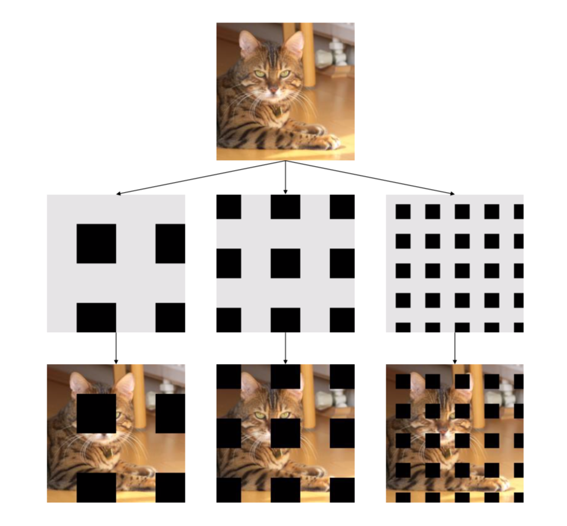
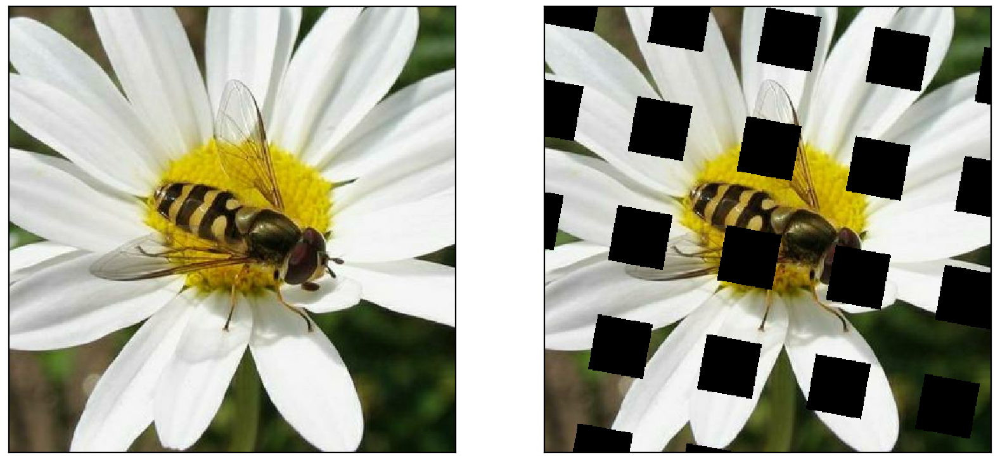
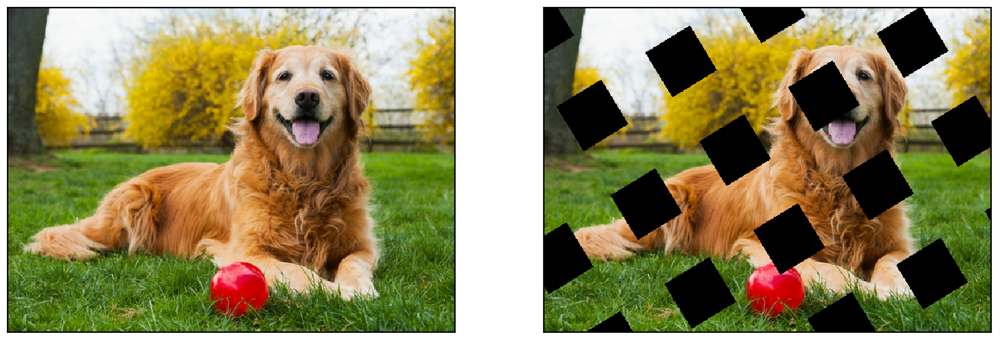

# GridMask data augmentation implementation in tensorflow

This repo is the implementation of GridMask in pure tensorflow(not official).  
Please refer to [GridMask](https://arxiv.org/abs/1805.08318) for official implementation in pytorch.  

## Dependencies

python 3.6  
Tensorflow 2.1.0  

## Example

Daisy gridmask before & after

Dog gridmask before & after

## Reference

[GridMask paper](https://arxiv.org/abs/1805.08318)  
[Official GridMask repo](https://github.com/akuxcw/GridMask)
